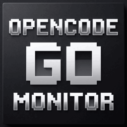
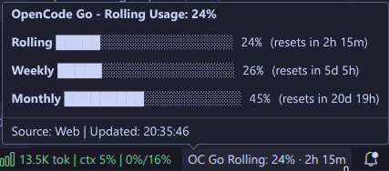

# OpenCode Go Monitor

<p align="center">
  
</p>

<p align="center">
  <a href="https://github.com/jorgealonsodev/opencode-go-monitor/releases"></a>
  <a href="LICENSE"></a>
</p>

A VSCode extension for real-time OpenCode Go quota monitoring in your status bar.

## Overview

**OpenCode Go Monitor** is a VS Code: extension that brings real-time quota visibility directly to your editor. Track your OpenCode Go usage without leaving your development environment, with intelligent dual-backend fetching, historical trend prediction, and full bilingual support (English/Spanish).

## Features

- **Real-time Status Bar Monitoring**: Current usage percentage and reset countdown
- **Dual-Backend Fetching**: API-first with HTML scraping fallback
- **Historical Tracking**: Local storage with linear regression exhaustion prediction
- **Bilingual Interface**: Automatic EN/ES detection based on VSCode locale
- **Rich Hover Tooltips**: Progress bars for Rolling, Weekly, and Monthly windows
- **Smart Interaction**: Single-click refresh, double-click details
- **Global Credential Persistence**: Secure storage via VSCode SecretStorage (OS Keychain)

## Screenshots



*Hover over the status bar item to see detailed progress bars for all three quota windows.*

## Installation

### From VSIX

1. Download the latest `.vsix` from [Releases](https://github.com/jorgealonsodev/opencode-go-monitor/releases)
2. Open VSCode
3. Go to Extensions view (`Ctrl+Shift+X` / `Cmd+Shift+X`)
4. Click `...` → **Install from VSIX...**
5. Select the downloaded file
6. Reload VSCode (`Ctrl+Shift+P` → `Developer: Reload Window`)

### From Source

```bash
git clone https://github.com/jorgealonsodev/opencode-go-monitor.git
cd opencode-go-monitor/opencode-go-monitor
npm install
npm run build
npm run package
```

## Quick Start

1. **Configure Credentials**:
   - `Ctrl+Shift+P` → `OpenCode Go: Configure Credentials`
   - Enter your `workspaceId` (from URL: `/workspace/{id}/go`)
   - Enter your `auth` cookie (from browser DevTools → Application → Cookies → `opencode.ai`)

2. **Monitor**: The status bar will immediately show your current usage.

3. **Interact**:
   - **1 click**: Refresh quota immediately
   - **2 clicks**: Open detailed breakdown
   - **Hover**: See progress bars for all windows

## Configuration

| Setting | Default | Description |
|---------|---------|-------------|
| `opencodeGoQuota.pollIntervalSeconds` | `300` | Poll frequency (min: 60s) |
| `opencodeGoQuota.warningThreshold` | `80` | Warning color threshold (%) |
| `opencodeGoQuota.errorThreshold` | `95` | Error color threshold (%) |
| `opencodeGoQuota.fetcherStrategy` | `"auto"` | `auto`, `api`, or `scraping` |
| `opencodeGoQuota.displayWindow` | `"rolling"` | `rolling`, `weekly`, or `monthly` |
| `opencodeGoQuota.debug` | `false` | Enable debug logging |

## Commands

| Command | Description |
|---------|-------------|
| `OpenCode Go: Configure Credentials` | Set workspace ID and auth cookie |
| `OpenCode Go: Refresh Quota` | Force immediate quota fetch |
| `OpenCode Go: Show Details` | Open detailed breakdown QuickPick |
| `OpenCode Go: Export History` | Export historical data to JSON |
| `OpenCode Go: Open Dashboard` | Open OpenCode dashboard in browser |
| `OpenCode Go: Clear Credentials` | Remove all stored credentials |
| `OpenCode Go: Select Display Window` | Choose quota window to display |

## Project Structure

```
opencode-go-monitor/
├── opencode-go-monitor/          # VSCode Extension
│   ├── src/
│   │   ├── commands/           # VSCode command handlers
│   │   ├── domain/             # Core types, formatting, prediction
│   │   ├── fetchers/           # API and scraping fetchers
│   │   ├── storage/            # Credentials and history storage
│   │   ├── ui/                 # Status bar and QuickPick components
│   │   ├── i18n.ts             # Internationalization (EN/ES)
│   │   └── extension.ts        # Extension entry point
│   ├── test/                   # Unit tests
│   ├── package.json            # Extension manifest
│   ├── package.nls.json        # English translations
│   ├── package.nls.es.json     # Spanish translations
│   └── README.md               # Extension documentation
├── PRD-opencode-go-monitor-vscode.md  # Product Requirements Document
└── README.md                   # This file
```

## Security

This extension prioritizes security:

- **Credentials**: Stored in VSCode SecretStorage (OS Keychain: macOS Keychain, Windows Credential Manager, Linux Secret Service)
- **Network**: HTTPS-only connections to `opencode.ai` and `console.opencode.ai`
- **No Telemetry**: Zero data collection or third-party tracking
- **No Dynamic Code**: Zero `eval()`, `Function()`, or dynamic code execution
- **Audit**: Comprehensive security audit performed; all critical findings resolved

## Development

```bash
# Install dependencies
cd opencode-go-monitor
npm install

# Compile TypeScript
npm run compile

# Run tests
npm test

# Build production bundle
npm run build

# Package as .vsix
npm run package
```

## Troubleshooting

### "Could not find quota usage data in HTML"

The cookie is likely expired. Try:
1. Log out and back in to [opencode.ai](https://opencode.ai)
2. Get a fresh `auth` cookie from DevTools
3. Re-configure credentials

### "Auth expired" in status bar

Your session cookie has expired. Follow the steps above to get a new one.

### Debug mode

Enable debug logging by setting `opencodeGoQuota.debug` to `true`. View logs in `View → Output → OpenCode Go Monitor`.

## License

MIT

## Author

[jorgealonsodev](https://github.com/jorgealonsodev)
